# 📊 npm-stat Modern UI

> **[📖 English](README.md)**
> **[📖 简体中文(大陆)](README.zh-cn.md)**

[](https://npm-stat.com/) A Tampermonkey userscript that modernizes the npm-stat.com query and chart pages.

<a href="https://github.com/VincentZyuApps/npm-stat.com-but-modern-ui/releases"></a>
<a href="https://vincentzyuapps.github.io/npm-stat.com-but-modern-ui/npm-stat-modern-ui.user.js"></a>
<a href="https://gitee.com/vincent-zyu/npm-stat.com-but-modern-ui/releases"></a>
<a href="https://greasyfork.org/zh-CN/scripts/596128-npm-stat-modern-ui"></a>

## 🔨 Build

```powershell
npm install
npm run build
```

The standalone userscript is generated at:

```text
dist/npm-stat-modern-ui.user.js
```

`dist/` is generated locally and is not committed.

## 🚀 Public installation

Install Tampermonkey or a compatible userscript manager, then use one of these links. The GitHub Pages link is the recommended persistent installation and update source.

| Channel | Install or download |
| --- | --- |
| GitHub Pages | [Install the latest userscript](https://vincentzyuapps.github.io/npm-stat.com-but-modern-ui/npm-stat-modern-ui.user.js) |
| Greasy Fork | [Install from Greasy Fork](https://greasyfork.org/zh-CN/scripts/596128-npm-stat-modern-ui) |
| GitHub Release | [Browse versioned downloads](https://github.com/VincentZyuApps/npm-stat.com-but-modern-ui/releases) |
| Gitee Release | [Browse the China mirror](https://gitee.com/vincent-zyu/npm-stat.com-but-modern-ui/releases) |

After the manager opens its installation page, select **Install** and refresh npm-stat.com. The userscript checks the Pages URL for updates; leave the manager's automatic-update setting enabled.

## 📥 Local Installation

1. In Tampermonkey, disable or delete `npm-stat Modern UI (Development Loader)` if it was installed previously.
2. Create a new userscript in Tampermonkey.
3. Replace its contents with the complete contents of `dist/npm-stat-modern-ui.user.js`, then save.
4. Refresh `https://npm-stat.com/charts.html?package=koishi-plugin-cs-lookup-vincentzyu-fork`.

## ✅ Validation

```powershell
npm run check
```

This runs TypeScript validation, chart data tests, produces the userscript, verifies its metadata, and syntax-checks the result.

## 🧪 Example test links

Each link compares five packages. The first four cover **2015-01-01 to 2026-09-15**; the Koishi example covers **2025-09-16 to 2026-09-15**, matching its ranking period. Links omit UI parameters so you can use your own appearance and aggregation preferences.

### 🌐 1. Frontend development

`react`, `vue`, `svelte`, `preact`, `@angular/core`.

https://npm-stat.com/charts.html?package=react&package=vue&package=svelte&package=preact&package=%40angular%2Fcore&from=2015-01-01&to=2026-09-15 — Framework history, different download scales, and scoped package names.

### ⚙️ 2. Backend development

`express`, `koa`, `fastify`, `@nestjs/core`, `@hapi/hapi`.

https://npm-stat.com/charts.html?package=express&package=koa&package=fastify&package=%40nestjs%2Fcore&package=%40hapi%2Fhapi&from=2015-01-01&to=2026-09-15 — Multiple series, weekly/monthly totals, and mean versus total aggregation.

### 🖥️ 3. Desktop development

`electron`, `electron-builder`, `@electron/packager`, `@tauri-apps/api`, `nw`.

https://npm-stat.com/charts.html?package=electron&package=electron-builder&package=%40electron%2Fpackager&package=%40tauri-apps%2Fapi&package=nw&from=2015-01-01&to=2026-09-15 — Desktop runtimes and tooling, long package names, and contrasting curves.

### 🧰 4. General development

`typescript`, `lodash`, `rxjs`, `dayjs`, `zod`.

https://npm-stat.com/charts.html?package=typescript&package=lodash&package=rxjs&package=dayjs&package=zod&from=2015-01-01&to=2026-09-15 — Large download counts, long-range aggregation, and zoom.

### 🧩 5. My Koishi plugins

`koishi-plugin-awa-quote-image`, `koishi-plugin-music-link-vincentzyu-fork`, `koishi-plugin-onebot-info-image`, `koishi-plugin-wydashen-guangyi-query`, `koishi-plugin-get-qq-bot-transfer-link`.

https://npm-stat.com/charts.html?package=koishi-plugin-awa-quote-image&package=koishi-plugin-music-link-vincentzyu-fork&package=koishi-plugin-onebot-info-image&package=koishi-plugin-wydashen-guangyi-query&package=koishi-plugin-get-qq-bot-transfer-link&from=2025-09-16&to=2026-09-15 — Personal projects, lower download counts, zero-download periods, and peaks.

Some packages were published after the start of the range, so early periods may have no download records. npm downloads are not user counts; these groups are chart-testing examples, not direct popularity rankings between different kinds of tools.

### 🏆 Koishi selection and annual ranking

Snapshot queried on **2026-09-16**, using npm Downloads API counts for **2025-09-16 through 2026-09-15**. Candidates came from the local Koishi project’s `external` directory, using actual `package.json.name` values. Only packages published in npm Registry with `vincentzyu` among their maintainers were eligible. Unpublished experiments and upstream packages maintained by others were excluded.

| Rank | Package | Downloads in the period |
| --- | --- | ---: |
| 1 | `koishi-plugin-awa-quote-image` | 8,041 |
| 2 | `koishi-plugin-music-link-vincentzyu-fork` | 6,802 |
| 3 | `koishi-plugin-onebot-info-image` | 4,567 |
| 4 | `koishi-plugin-wydashen-guangyi-query` | 3,479 |
| 5 | `koishi-plugin-get-qq-bot-transfer-link` | 3,008 |

This ranking covers eligible local candidates with available statistics, not the entire Koishi market. Published packages without available Downloads API statistics were not treated as having zero downloads and were excluded from ranking; at this snapshot, that included `koishi-plugin-steam-vincentzyu`.

## 🎨 Seven appearance styles

Use the top-right dropdown to choose Original npm-stat, npm, Vercel, Fluent, Material 3, Apple (iOS/macOS), or GitHub. The adjacent emoji button independently cycles system/light/dark. Both preferences persist; npm is the default style. Switching preserves form inputs, chart zoom, legend selection and the daily chart scale without fetching data again.

Original restores a simpler presentation while retaining ECharts and query enhancements. Shared layout lives in `src/styles.css`; each appearance has its own light/dark CSS in `src/styles/`. All styles are bundled locally into the userscript. Data and chart logic live in `src/data.ts` and `src/renderer.ts`; Vite types live in `src/vite.d.ts`.

## 📈 Long-range charts and aggregation

The content area grows to 2500px, with 1px chart lines (1.5px on hover). Daily and weekly charts each have eight grouping sizes: 1, 2, 3, 4, 5, 10, 25 and 50, plus one mean/total toggle. They are independent, start at size 1 and mean, and remember manual changes. Daily Linear/Log remains separate; logarithmic axes omit zero values rather than replacing them with positive values.

Groups start at the beginning of the full query range, regardless of zoom. Each package is aggregated separately on shared boundaries. Mean divides by the actual number of days or weeks, including zero-download periods; total sums downloads. A trailing short group is retained. Weekly means average the provided weekly totals, including partial first/last weeks without extrapolation. Tooltips show full ISO week names, covered dates, actual group size and totals. The summary metrics always use original daily data.

## 🔗 Sharing settings

Copy the address bar: settings update automatically with `history.replaceState`, without reloads or extra history entries. No share button is needed. Supported parameters:

| Parameter | Values |
| --- | --- |
| `ui_style` | `original`, `npm`, `vercel`, `fluent`, `material`, `apple`, `github` |
| `ui_theme` | `system`, `light`, `dark` |
| `ui_day_size`, `ui_week_size` | `1`, `2`, `3`, `4`, `5`, `10`, `25`, `50` |
| `ui_day_mode`, `ui_week_mode` | `mean`, `sum` |

Each setting resolves from a valid URL value, then local memory, then the default. Opening a shared link never overwrites your saved preferences. Only settings you manually change are saved. `system` follows the recipient's system; use `light` or `dark` to share a fixed appearance. Query submissions and same-site chart links carry the current settings. Packages, dates, unrelated parameters and URL fragments are retained as appropriate. Zoom, hidden legend items and Linear/Log are not serialized.

Users without this userscript can still open the query; only the UI enhancements require installation.

## 📷 Appearance screenshots

Real-page screenshots of all seven styles, with light and dark side by side. Click an image to view the full size.

| Style | Light | Dark |
| --- | --- | --- |
| Original npm-stat | [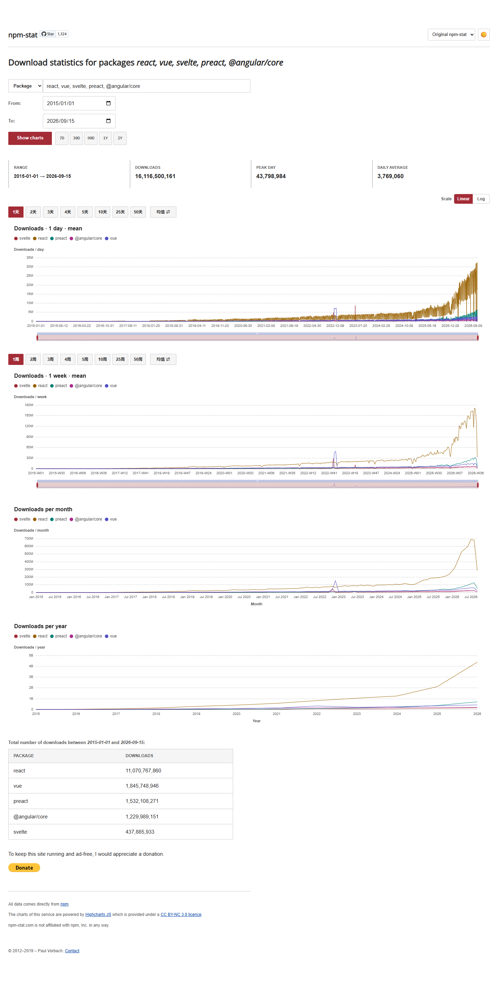](docs/images/preview/light-original.png) | [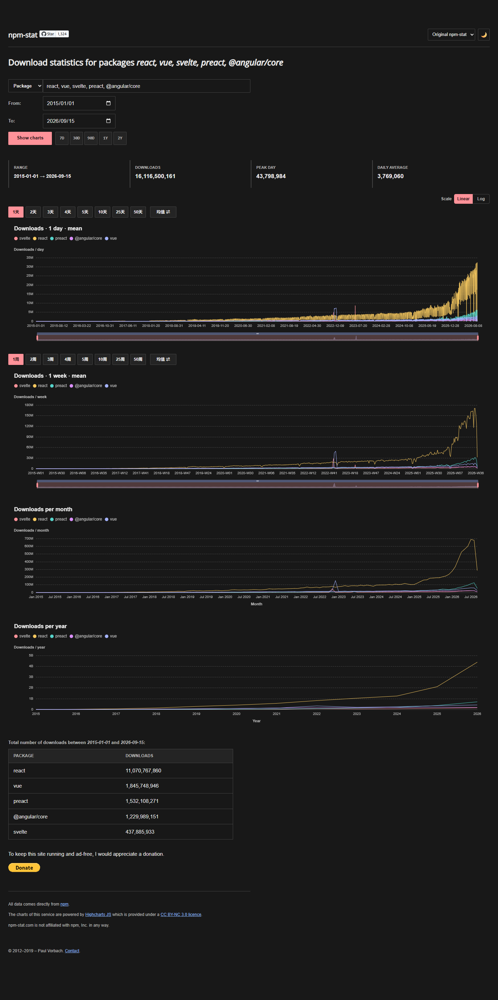](docs/images/preview/dark-original.png) |
| npm | [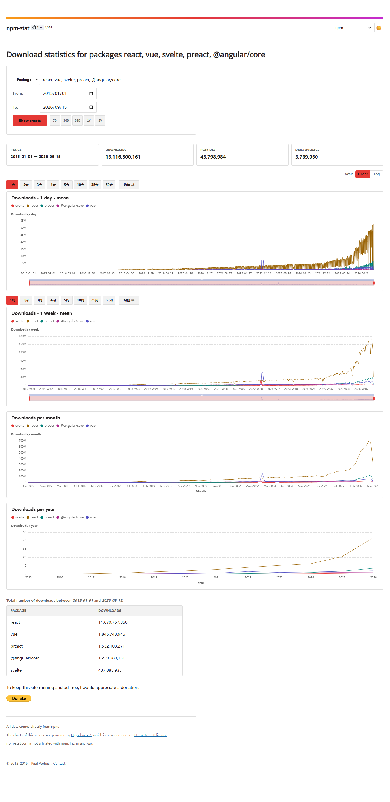](docs/images/preview/light-npm.png) | [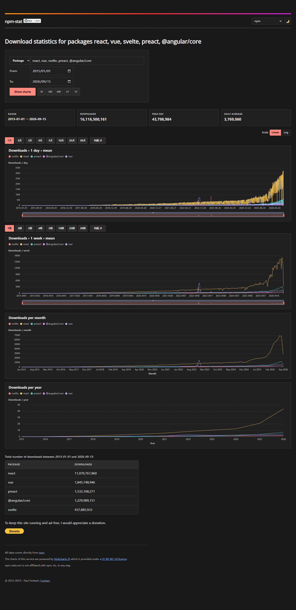](docs/images/preview/dark-npm.png) |
| Vercel | [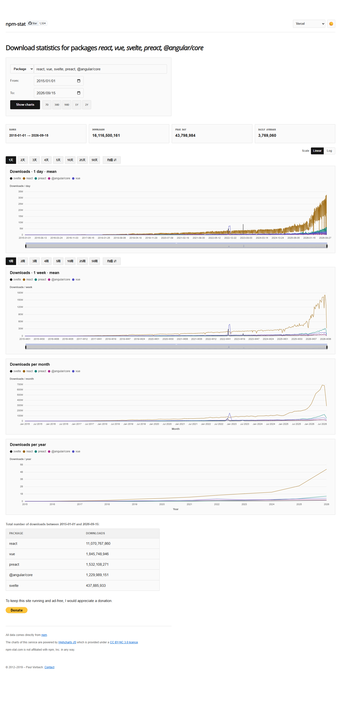](docs/images/preview/light-vercel.png) | [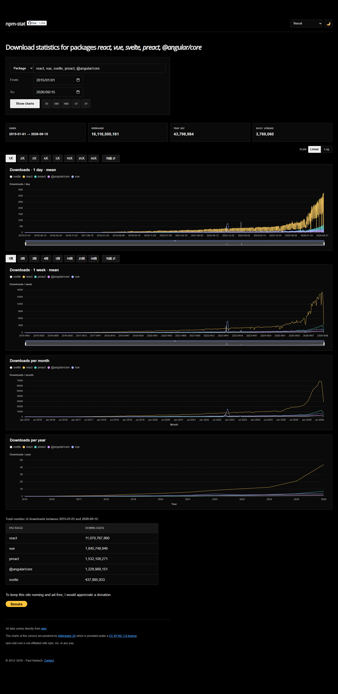](docs/images/preview/dark-vercel.png) |
| Windows Fluent | [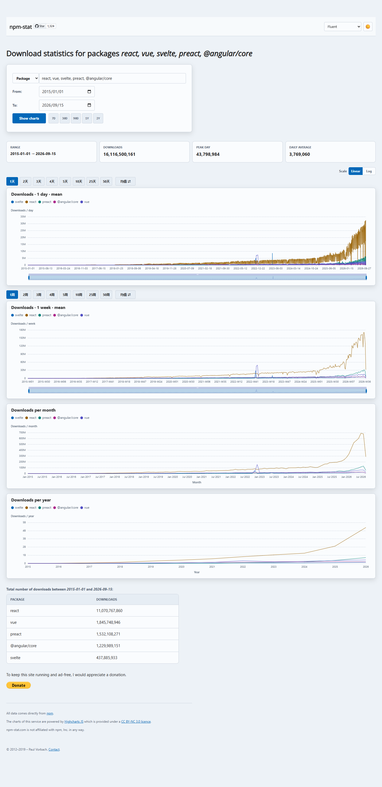](docs/images/preview/light-fluent.png) | [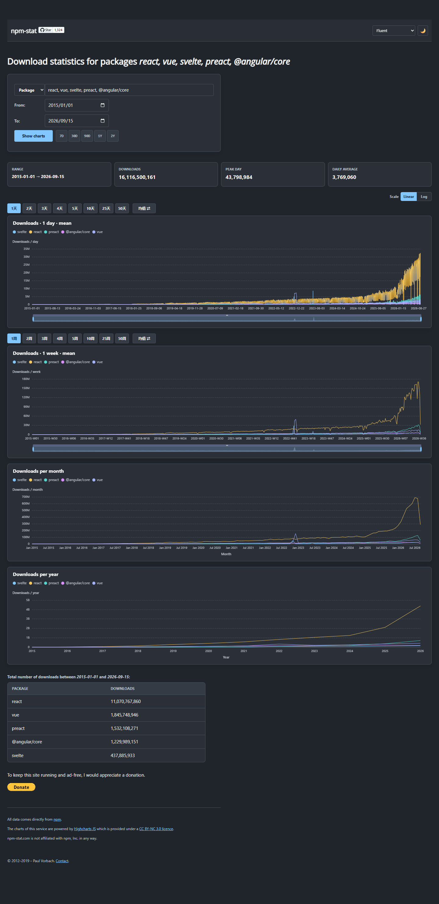](docs/images/preview/dark-fluent.png) |
| Google Material 3 | [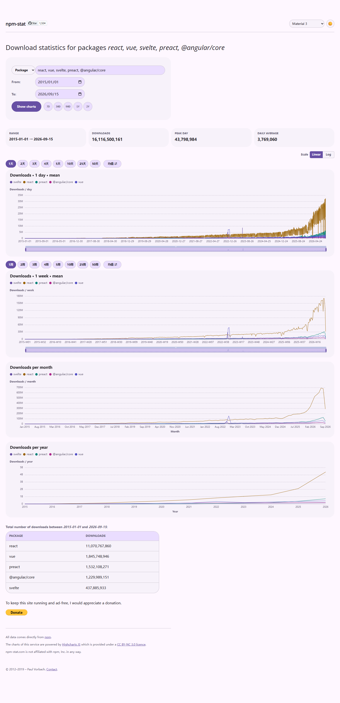](docs/images/preview/light-material.png) | [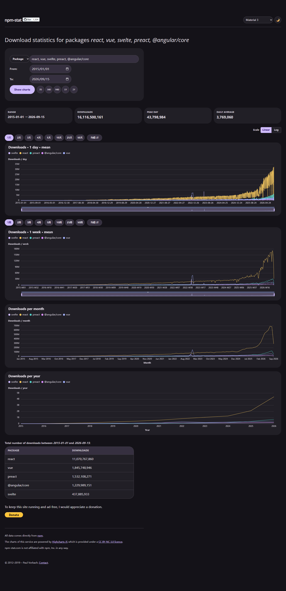](docs/images/preview/dark-material.png) |
| Apple iOS/macOS | [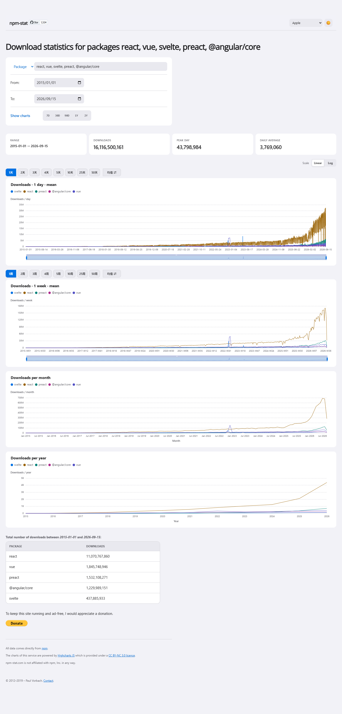](docs/images/preview/light-apple.png) | [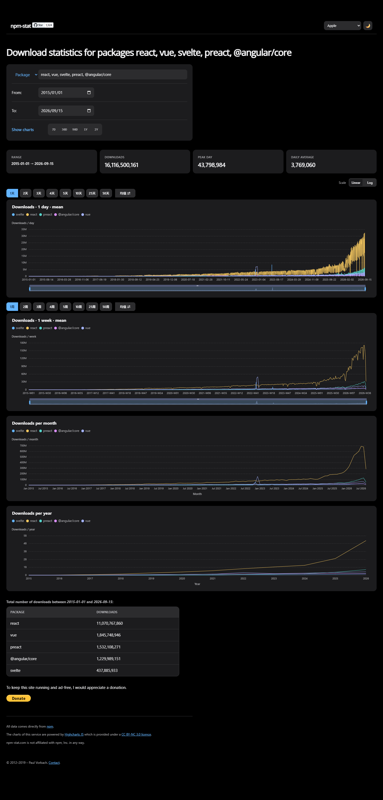](docs/images/preview/dark-apple.png) |
| GitHub | [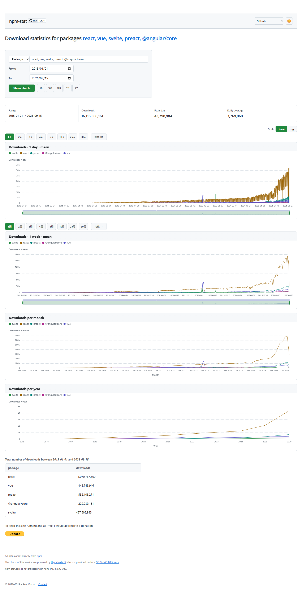](docs/images/preview/light-github.png) | [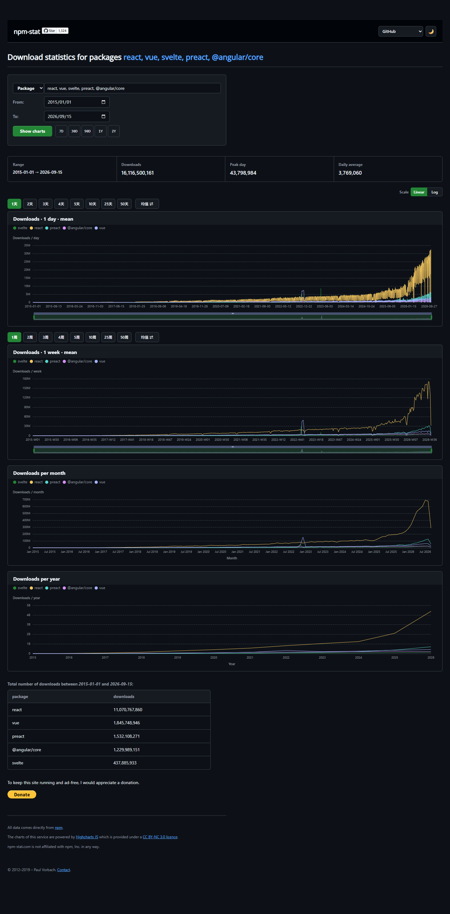](docs/images/preview/dark-github.png) |

Run `npm run docs:screenshots` to build and recapture automatically without Tampermonkey. Real extension mode first requires you to install Tampermonkey, allow userscripts, paste the built JS, and refresh to confirm. See the [screenshot tooling guide](scripts/docs/readme.md) for both entry points, all options, and step-by-step instructions.
